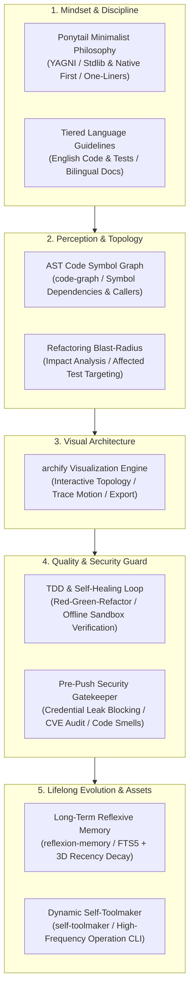

# My First AI Agent

<p align="left">
  <b>English</b> | <a href="README.zh-CN.md">简体中文</a>
</p>

An autonomous, self-improving AI Agent workspace engineered with **Long-Term Reflexive Memory**, **Dynamic Self-Toolmaking**, **Context Optimization (MCP)**, and **Multi-Language Internationalization**.

---

## Why This AI Agent?

Most modern AI coding assistants act merely as "smart typists"—often introducing painful friction:
- **Over-engineering & Bloat**: Creating multiple redundant interfaces, factory classes, and unvetted dependencies for simple tasks.
- **Silent Breakages ("Fix A, Break B")**: Modifying core functions without visibility into downstream dependents, causing widespread regressions.
- **Credential Leak Risks**: Accidental exposure of hardcoded API keys and credentials in Git commits.
- **Persistent Amnesia**: Repeating identical debugging mistakes across conversations without retaining causal lessons.

### Design Philosophy
> **"The cleanest, most reliable code is the code that never had to be written. Hand repetitive friction to machines, and reserve certainty for humans."**

This agent transforms coding from unpredictable "probabilistic generation" into deterministic, production-grade assembly with five integrated pillars:
1. **Minimalist Decision Mindset (`Ponytail`)**: Enforces a 7-rung necessity ladder (YAGNI, stdlib & native first) to eliminate bloat.
2. **Code Awareness Radar (`AST & Blast-Radius`)**: Computes exact downstream callers and affected test suites before modifying code.
3. **Deterministic Quality & Security (`TDD Sandbox` + `Pre-Push Gatekeeper`)**: Executes Red-Green-Refactor tests in local offline sandboxes (0 token overhead) and hard-blocks secret leaks.
4. **Lifelong Evolution (`Reflexion Memory` + `Self-Toolmaker`)**: Distills post-mortem lessons into SQLite FTS5 memory and synthesizes repetitive commands ($\ge 3$ times) into CLI assets.
5. **Architectural Transparency (`Archify`)**: Renders reactive, interactive visual blueprints with animated trace motion for instant team alignment.

---

## Agent Capability Matrix (Five Pillars)



<p align="center">
  <sub>Interactive live diagrams: <a href="agent-workflow.html">Agent Operational Workflow</a> | <a href="reflexion-memory-architecture.html">Reflexion Memory Engine</a> (supports dark/light theme, trace motion & full-canvas pan/zoom)</sub>
</p>

---

## Architecture & Capabilities

1. **Long-Term Reflexive Memory (`src/memory/`)**:
   - Stores historical trajectories, failure patterns, root causes, and corrective heuristics instead of static document chunks.
   - Built on native `node:sqlite` (WAL mode + FTS5 full-text indexing) with zero external native compilation dependencies.
   - Multi-dimensional scoring ranking by Relevance ($\alpha=0.5$), Recency exponential decay ($\beta=0.2$), and Importance ($\gamma=0.3$).
2. **Dynamic Self-Toolmaker (`src/toolmaker/` & `.agents/scripts/`)**:
   - Tracks recurring command patterns; automatically synthesizes robust Node.js CLI tools when an operation is performed $\ge 3$ times.
   - Unified dispatcher: `node .agents/scripts/runner.js <tool-name> [args]`.
3. **Context Optimization (`.agents/plugins/context-mode`)**:
   - Scoped project plugin running `context-mode` MCP server to save token consumption on complex tasks.
4. **Interactive Architecture Visualization (`archify`)**:
   - Interactive SVG/HTML system topology maps with light/dark themes, animated trace flows, and visual export capabilities.
5. **Ponytail Minimalist Coding Philosophy (`.agents/skills/ponytail/`)**:
   - Enforces a 7-rung necessity ladder (YAGNI, codebase reuse, stdlib first, native platform, installed dependencies, one-line solutions). Rejects unrequested abstractions and premature complexity while strictly preserving security, boundary validation, and error handling.
6. **Tiered Internationalization (`src/i18n.js` & `locales/`)**:
   - Professional `i18next` integration supporting dynamic switching, locale key audit, and adaptive CLI output.
7. **TDD & Self-Healing Loop (`.agents/skills/tdd-workflow/`)**:
   - Strict Red-Green-Refactor discipline; failing tests are written first before functional implementation. Runs offline with zero external token overhead.
8. **Pre-Push Security Gatekeeper (`.agents/scripts/pre-push-check.js`)**:
   - Automated check executed strictly prior to `git push` (via `.git/hooks/pre-push` or CLI) to intercept hardcoded API keys, audit dependencies, and flag code smell.
9. **Code Symbol Graph & Blast-Radius Analysis (`src/graph/` & `blast-radius.js`)**:
   - Zero-dependency AST and symbol dependency graph engine. Calculates direct/indirect impact scopes, flags affected test suites, and generates actionable pre-refactoring safety plans.

---

## Directory Structure

```text
.
├── .agents/
│   ├── plugins/context-mode/       # Project-isolated MCP server configuration
│   ├── scripts/                    # Synthesized CLI tool assets (runner.js, audit-locales.js, blast-radius.js)
│   ├── skills/                     # Agent behavioral skills (archify, ponytail, reflexion-memory, self-toolmaker, i18n, code-graph)
│   └── memory.db                   # SQLite persistent episodic & reflective memory database
├── locales/                        # Internationalization locale packs (en-US, zh-CN)
├── src/
│   ├── memory/                     # Reflexion Long-Term Memory engine & FTS5 retriever
│   ├── toolmaker/                  # Pattern tracking and CLI script synthesis engine
│   ├── graph/                      # Symbol graph & blast-radius analysis engine
│   └── i18n.js                     # Runtime i18next configuration
├── examples/                       # Interactive runnable system demos
├── test/                           # Automated test suites
├── AGENTS.md                       # Authoritative project rules and behavioral guidelines
├── README.md                       # English documentation
└── README.zh-CN.md                 # Chinese documentation
```

---

## Quickstart

### 1. Run Automated Test Suites
```bash
npm test
```

### 2. Query Long-Term Memory
```bash
node src/memory/index.js search "install sqlite native addons in sandbox"
```

### 3. Run Synthesized Project Tools
```bash
# List all synthesized project tools
node .agents/scripts/runner.js --list

# Analyze blast radius before modifying a file or symbol
node .agents/scripts/runner.js blast-radius --target src/memory/db.js --tree

# Run pre-push security & quality gatekeeper
node .agents/scripts/runner.js pre-push-check

# Run locale audit tool with automatic language adaptation
node .agents/scripts/runner.js audit-locales
```

---

## License
MIT
