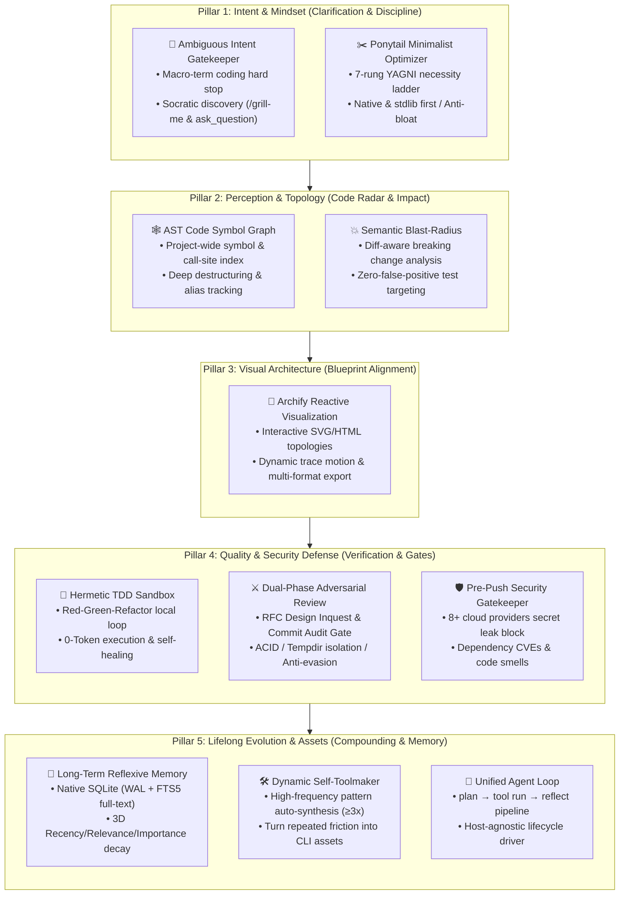

# ⚡ My First AI Agent

<p align="center">
  <b>The Industrial-Grade Engineering Fortress for IDE Coding Agents</b>
  <br />
  <i>Equipping Cursor, Antigravity, and Claude Code with Architectural Memory, Blast-Radius Radar, Minimalist Discipline, and Zero-Trust Security Gates.</i>
</p>

<p align="center">
  <a href="LICENSE"></a>
  <a href="test/"></a>
  <a href=".agents/skills/"></a>
  <a href="README.zh-CN.md"></a>
</p>

<p align="center">
  <b>English</b> | <a href="README.zh-CN.md">简体中文</a>
</p>

---

## 💡 The "Smart Typist" Dilemma

Most AI coding assistants today act like eager junior developers on energy drinks: they type fast, but they have **no memory**, **no architectural perception**, and **no restraint**. They frequently fall into classic traps:
- 🏗️ **Over-engineering & Bloat**: Creating 8 factory classes, 5 abstract interfaces, and 3 unvetted npm packages for a 10-line feature.
- 💥 **"Fix A, Break B" Cascades**: Tweaking a shared utility function with zero visibility into downstream callers, causing silent regressions across the codebase.
- 🔑 **Credential Leaks**: Committing real API keys, cloud tokens, and secrets directly into Git history.
- 🔄 **Amnesia & Groundhog Day**: Forgetting debugging discoveries between sessions and making the exact same mistakes again.
- 🌀 **Blind Hallucinations on Macro Prompts**: Diving straight into writing buggy code when given unbounded requests like *"Build me an e-commerce store"*.
- 🤝 **Rubber-Stamping PRs**: Self-approving its own broken implementations without independent scrutiny.

### 🛡️ Why This Agent System?

This project is **not** another standalone LLM runtime. It is an **industrial-grade skill pack and local tool fortress** that plugs directly into host coding agents (**Google Antigravity, Cursor, Claude Code**). 

It governs the host agent through strict behavioral disciplines, deterministic static analysis, and reflexive memory:

| Engineering Challenge | Vanilla AI Assistant ("Smart Typist") | ⚡ This AI Agent System |
| :--- | :--- | :--- |
| **Vague / Macro Prompts** | Hallucinates 500 lines of irrelevant code blindly | **Hard-stops coding**; initiates Socratic `/grill-me` interviews to lock deterministic MVP scopes |
| **Architectural Restraint** | Generates bloated boilerplate, factory patterns & dependencies | **Ponytail 7-Rung YAGNI Ladder**: Native first, stdlib first, single responsibility |
| **Code Refactoring Safety** | Edits files blind; breaks downstream callers unknowingly | **AST Symbol Graph & Semantic Blast-Radius**: Identifies all callers and locks affected test suites |
| **Architecture Visibility** | Dumps unreadable text walls | **Archify Engine**: Compiles interactive HTML diagrams with animated trace flows |
| **Verification & Cost** | Burn tokens re-asking the LLM to inspect code | **Hermetic TDD Sandbox**: 100% offline Red-Green-Refactor with 0 external token consumption |
| **Code Review & Quality** | Self-approves its own flawed solutions | **Dual-Phase Adversarial Review**: Independent Red-Blue subagent RFC Inquest & Commit Audit gates |
| **Security & Secrets** | Commits API tokens & private keys to Git | **Pre-Push Gatekeeper**: Hard-blocks 8+ cloud provider secrets and audits CVEs before push |
| **Continuous Learning** | Suffers amnesia; repeats identical errors across sessions | **Long-Term Reflexive Memory**: SQLite WAL + FTS5 full-text search with 3D recency/relevance scoring |
| **Repetitive Chores** | Manually repeats commands every session | **Dynamic Self-Toolmaker**: Automatically synthesizes Node.js CLI tools when an operation hits $\ge 3\times$ |

---

## 🏛️ Core Design Philosophy

> **"The cleanest, most reliable code is the code that never had to be written. Hand repetitive friction to machines, and reserve certainty for humans."**

---

## 🧭 Architecture Flow: The Five Pillars

The system operates across **Five Sequential Engineering Pillars**, ensuring complete safety from the moment a requirement is received to the moment code is committed:



---

## 🔍 Detailed Capabilities & Engineering Pillars

### Pillar 1: Intent & Mindset (Clarification & Minimalist Discipline)

#### 1.1 Ambiguous Intent Clarification Gatekeeper (`AGENTS.md`)
- **Problem**: When prompted with broad, macro goals (*"Build an e-commerce store"*, *"Create a community blog"*), vanilla agents start hallucinating hundreds of lines of disjointed code without knowing real requirements.
- **Solution**: Implements a strict **Coding Hard-Stop**. When macro terms are detected, the agent is barred from touching source code. Instead, it activates an interactive Socratic discovery interview (via `/grill-me` and `ask_question`), forcing clarity on:
  - Precise target user & core user story.
  - MVP boundary slicing (defining what is strictly in v0.1 and what is deferred).
  - Technical constraints and data models.
- Only when requirements are deterministic and visually aligned will development proceed.

#### 1.2 Ponytail Minimalist Optimizer ([`.agents/skills/ponytail/`](https://github.com/DietrichGebert/ponytail) by Dietrich Gebert)
- **Problem**: LLMs suffer from "architectural excess"—over-engineering simple tasks with abstract classes, wrapper upon wrapper, and unnecessary npm dependencies.
- **Solution**: Integrates the **Ponytail 7-Rung YAGNI Necessity Ladder**:
  1. *Rung 1 (YAGNI)*: Can we simply not build this?
  2. *Rung 2 (Codebase Reuse)*: Does an existing function or utility already do this?
  3. *Rung 3 (Language Built-ins)*: Can modern JavaScript/Node.js native APIs do this without dependencies?
  4. *Rung 4 (Platform & Environment)*: Can the OS/shell handle this natively?
  5. *Rung 5 (Installed Dependencies)*: Can an existing dependency in `package.json` solve it?
  6. *Rung 6 (Write Custom Minimal)*: Write single-responsibility, unbloated code.
  7. *Rung 7 (Add New Dependency)*: Strictly a last resort with high justification.

---

### Pillar 2: Perception & Topology (Code Radar & Impact Analysis)

#### 2.1 AST Code Symbol Graph (`src/graph/`)
- **Problem**: LLMs read code as flat text files, lacking understanding of lexical scopes, module exports, and cross-file caller dependencies.
- **Solution**: Built on Acorn AST parsing (`acorn` + `acorn-walk`), indexing the entire codebase:
  - Extracts classes, functions, variables, ESM/CommonJS imports & exports.
  - Resolves cross-file module paths and handles deep object destructuring and aliases (`const { a: foo } = require(...)`).
  - Maps global call-sites while eliminating false-positive matches for built-in JavaScript globals (`console.log`, `Math.max`, `JSON.stringify`).

#### 2.2 Semantic Refactoring Blast-Radius (`blast-radius.js` & `src/graph/`)
- **Problem**: The dreaded "Fix A, Break B" regression. Changing an exported function's signature silently breaks upstream callers and test suites.
- **Solution**: A pre-refactoring impact radar executed *before* editing code:
  - **Diff-Aware Slicing**: Compares uncommitted working tree changes (`git diff`) against the AST to determine if modified lines touch private internals (`LOCAL_PRIVATE`, low risk) or public contracts (`PUBLIC_CONTRACT`, high risk).
  - **Semantic Arity & Breaking Change Analysis**: Evaluates parameter mutations. Adding an optional parameter with a default value (`fn(a, b = 1)`) is assessed as `COMPATIBLE`; adding a mandatory parameter (`fn(a, b)`) or changing a function from synchronous to asynchronous without `await` in callers is flagged as `BREAKING`.
  - **Pinpointed Test Suite Targeting**: Automatically locks down the exact test files impacted by the change so the agent tests the blast zone immediately.

```bash
# Analyze impact on a file before refactoring (with ASCII dependency tree)
node .agents/scripts/runner.js blast-radius --target src/memory/db.js --tree

# Run diff-aware semantic blast radius on uncommitted working changes
node .agents/scripts/runner.js blast-radius --diff --semantic
```

---

### Pillar 3: Visual Architecture (Visual Blueprint & Interactive Alignment)

#### 3.1 Archify Reactive Visualization Engine ([`archify`](https://github.com/tt-a1i/archify) by tt-a1i)
- **Problem**: Complex architectures, multi-step workflows, and state transitions are difficult to review and confirm via plain text or static Mermaid snippets.
- **Solution**: Compiles code topology and workflows into interactive, standalone HTML/SVG artifacts:
  - **Dynamic Trace Motion**: Visualizes message sequences, execution pipelines, and data flows with animated particles.
  - **Dual-Theme Adaptive**: Instant toggle between high-contrast dark mode and clean light mode.
  - **Multi-Format Lossless Export**: Direct vector and raster export (SVG, PNG, WebM) for team presentations and documentation.

---

### Pillar 4: Quality & Security Defense (Zero-Token Verification & Ironclad Gates)

#### 4.1 Hermetic TDD Sandbox & Self-Healing Loop (`.agents/skills/tdd-workflow/`)
- **Problem**: Running code verification through external LLM APIs burns unnecessary tokens, introduces latency, and leaks proprietary logic.
- **Solution**:
  - **Red-Green-Refactor Flow**: For every bug fix or feature, the agent writes a failing test case in `test/` first (Red), writes the minimal production code to pass (Green), and cleans up (Refactor).
  - **100% Offline Sandbox Execution**: Tests run hermetically in local memory/temp directories with zero network requests—guaranteeing **0 external token consumption** on passing tests.
  - **Self-Healing Loop**: When tests fail, stack traces are captured, matched against `reflexion-memory` for known failure heuristics, and fixed autonomously.

#### 4.2 Dual-Phase Adversarial Review (`.agents/skills/adversarial-review/`)
- **Problem**: Single-agent setups suffer from confirmation bias: an authoring agent rubber-stamps its own buggy assumptions or vulnerabilities.
- **Solution**: Enforces an independent Red-Blue team adversarial protocol:
  - **Phase 1 (Design RFC Inquest Gate)**: Before touching code, a read-only Red-Team Subagent probes `implementation_plan.md` for edge cases, hallucination traps, and fail-open vulnerabilities, issuing a formal *Adversarial Inquest*. The authoring agent must incorporate concrete defensive clauses.
  - **Phase 2 (Commit Audit Gate)**: Before any `git commit`, `node .agents/scripts/runner.js adversary-check --staged` runs automated static checks (ACID transactions, temporary directory isolation, regex boundaries), followed by a mandatory independent subagent audit verifying the real Git diff.

#### 4.3 Pre-Push Security & Code Quality Gatekeeper (`.agents/scripts/pre-push-check.js`)
- **Problem**: Accidental leakage of production API keys or committing high-CVE packages to public GitHub repos.
- **Solution**: Runs strictly prior to `git push` (via `.git/hooks/pre-push` or manual runner):
  - **Hard-Blocks Secrets (Exit Code 1)**: Regex and Shannon entropy scanning covering 8+ major cloud and SaaS providers:
    - OpenAI, Anthropic, GitHub Personal Access Tokens, AWS Access Keys, Google Cloud API Keys, Stripe Live Keys, Slack Bot Tokens, and RSA/SSH Private Keys.
  - **Dependency Vulnerability Scans**: Runs automated `npm audit` to detect High and Critical CVEs.
  - **Code Smell Advisories**: Flags excessive function length (>80 lines) and deep cyclomatic nesting (>4 levels).

```bash
# Run pre-push gatekeeper audit manually
node .agents/scripts/runner.js pre-push-check
```

---

### Pillar 5: Lifelong Evolution & Asset Compounding (Memory & Self-Tooling)

#### 5.1 Long-Term Reflexive Memory (`src/memory/` & `reflexion-memory`)
- **Problem**: Standard RAG stores static document snippets. When an agent spends 30 minutes solving a tricky environment bug, that causal knowledge vanishes when the conversation ends.
- **Solution**: Implements academic *Reflexion* architecture over Node.js native `node:sqlite`:
  - **Zero Native Compilation Overhead**: Uses Node's built-in `node:sqlite` (with WAL mode and FTS5 full-text indexing)—no native C++ build toolchains or fragile binary bindings required.
  - **Causal Knowledge Storage**: Stores task trajectories, failure root causes, and distilled heuristic rules.
  - **3D Ranking Scoring Algorithm**: Ranks memories by a balanced multi-dimensional formula:
    $$\text{Score} = \alpha \cdot \text{Relevance} + \beta \cdot e^{-\lambda \Delta t} + \gamma \cdot \text{Importance}$$
    where $\alpha=0.5, \beta=0.2, \gamma=0.3$.

```bash
# Search reflexive memory for historical lessons
node src/memory/index.js search "sqlite native addons in sandbox"
```

#### 5.2 Dynamic Self-Toolmaker Engine (`src/toolmaker/` & `self-toolmaker`)
- **Problem**: Developers repeatedly prompt AI agents to perform the same manual operational sequences, wasting time and tokens.
- **Solution**:
  - Tracks execution patterns and intent fingerprints. When an operation is executed $\ge 3$ times, the system automatically synthesizes a tested, production-grade Node.js CLI script in `.agents/scripts/`.
  - Tools are registered in `.agents/scripts/registry.json` and executed via the unified dispatcher: `node .agents/scripts/runner.js <tool-name> [args]`.

```bash
# List all synthesized project CLI tools
node .agents/scripts/runner.js --list
```

#### 5.3 Unified Agent Loop Driver (`src/agent/` & `agent-loop`)
- **Problem**: Ad-hoc agent prompts lack standard lifecycles, causing tool execution errors to go unrecorded.
- **Solution**: A lightweight host-agnostic loop driving three clean lifecycle phases:
  - `plan`: Recalls relevant reflexive memories, suggests synthesized CLI tools, and computes refactoring blast radius before editing code.
  - `run`: Safely executes registered tools without arbitrary shell string risks.
  - `reflect`: Diagnoses task failures and automatically records distilled lessons back into SQLite memory.

```bash
# Retrieve memory and suggest tools for a task (read-only plan)
node src/agent/index.js plan "install native addon in sandbox"

# Plan a refactor with blast-radius attached (auto --diff --semantic on dirty files)
node src/agent/index.js plan "refactor MemoryDatabase" --target src/memory/db.js

# Execute a tool through the loop (records post-mortem if it fails)
node src/agent/index.js run "audit locale keys" --tool audit-locales --exec
```

---

## 🔌 Optional Extension: `context-mode` MCP

For extraordinarily long sessions with heavy tool payloads (browser DOM snapshots, large log dumps, massive issue lists), the optional `context-mode` MCP server can be activated.

- **Non-Invasive**: It is **not** an `npm install` dependency (avoiding bloat in standard checkouts).
- **On-Demand**: Configured in [`.agents/plugins/context-mode/mcp_config.json`](.agents/plugins/context-mode/mcp_config.json) and launched on-demand via `npx -y context-mode`.
- *Reflexion memory still governs engineering lessons; blast-radius still governs refactorings.*

---

## 📂 Directory Structure

```text
.
├── .agents/
│   ├── plugins/context-mode/       # Optional MCP configuration for context offloading
│   ├── scripts/                    # Synthesized CLI tools (runner.js, blast-radius.js, pre-push-check.js)
│   └── skills/                     # Agent behavioral skills (ponytail, archify, tdd, adversarial-review, etc.)
├── locales/                        # Internationalization locale packs (en-US, zh-CN)
├── src/
│   ├── agent/                      # Unified agent loop: plan → run → reflect
│   ├── memory/                     # Reflexion Long-Term Memory (node:sqlite WAL + FTS5)
│   ├── toolmaker/                  # Pattern tracker and automated CLI synthesis engine
│   ├── graph/                      # Acorn AST symbol graph & semantic blast-radius engine
│   └── i18n.js                     # Adaptive CLI internationalization engine
├── test/                           # Hermetic automated test suites (100% offline sandbox)
├── AGENTS.md                       # Authoritative project rules, policies & behavioral gates
├── README.md                       # Primary English documentation
└── README.zh-CN.md                 # Secondary Chinese documentation
```

---

## 🚀 Quickstart

### 1. Prerequisites & Installation
Ensure you have **Node.js ≥ 22.5.0** (required for built-in `node:sqlite`).
```bash
# Clone the repository
git clone https://github.com/your-org/my-first-ai-agent.git
cd my-first-ai-agent

# Install dependencies
npm install

# Run 100% hermetic offline test suites
npm test
```

### 2. Experience the Superpowers

#### Pre-Refactoring Blast Radius
```bash
# Inspect downstream impact and affected tests before touching code
node .agents/scripts/runner.js blast-radius --target src/memory/db.js --tree
```

#### Pre-Push Security Gate
```bash
# Audit commits for secret leaks and CVEs before pushing to GitHub
node .agents/scripts/runner.js pre-push-check
```

#### Query Historical Engineering Memory
```bash
# Recall lessons learned from past debugging sessions
node src/memory/index.js search "install sqlite native addon"
```

#### Run the Unified Agent Loop
```bash
# Plan a refactor with auto-diff semantic analysis
node src/agent/index.js plan "optimize query indexing" --target src/memory/db.js
```

---

## 🤝 Acknowledgements & Open-Source Credits

We express our deepest gratitude to the open-source creators and pioneers whose specialized paradigms empower this agent:

- **[Ponytail](https://github.com/DietrichGebert/ponytail)** by **[Dietrich Gebert](https://github.com/DietrichGebert)**:
  - The anti-overengineering "lazy senior developer" behavioral skill and 7-rung YAGNI necessity ladder. Licensed under MIT.
- **[Archify](https://github.com/tt-a1i/archify)** by **[tt-a1i](https://github.com/tt-a1i)** (derived from Cocoon-AI):
  - The industrial-grade interactive visual diagram compiler with animated trace flows and dual-theme SVGs. Licensed under MIT.
- **[LobeHub i18n Workflow](https://github.com/lobehub/lobe-chat)** by **[LobeHub](https://github.com/lobehub)**:
  - Best practices and flat-key dictionary standards for seamless internationalization.
- **[Reflexion](https://arxiv.org/abs/2303.11366)** by **Noah Shinn, et al.**:
  - The pioneering self-reflective memory architecture transforming trial-and-error feedback into durable heuristic rules.

---

## 📄 License
Released under the [MIT License](LICENSE).
