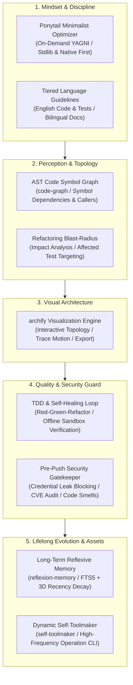

# My First AI Agent

<p align="left">
  <b>English</b> | <a href="README.zh-CN.md">简体中文</a>
</p>

A coding-agent skill pack and local tools: reflexion memory, self-toolmaker, blast-radius, and pre-push gates. It plugs into an IDE coding agent (Antigravity, Cursor, Claude Code). It is not a standalone LLM runtime.

A thin loop (`src/agent/`) wires them: retrieve memory → suggest/run a tool → optional blast-radius → record failures.

---

## Why this pack?

Most coding assistants act merely as "smart typists"—often introducing painful friction:
- **Over-engineering & Bloat**: Creating multiple redundant interfaces, factory classes, and unvetted dependencies for simple tasks.
- **Silent Breakages ("Fix A, Break B")**: Modifying core functions without visibility into downstream dependents, causing widespread regressions.
- **Credential Leak Risks**: Accidental exposure of hardcoded API keys and credentials in Git commits.
- **Persistent Amnesia**: Repeating identical debugging mistakes across conversations without retaining causal lessons.

### Design Philosophy
> **"The cleanest, most reliable code is the code that never had to be written. Hand repetitive friction to machines, and reserve certainty for humans."**

These skills and CLIs cover five jobs the host agent otherwise fumbles:
1. **Minimalist Decision Mindset ([`Ponytail`](https://github.com/DietrichGebert/ponytail) by Dietrich Gebert)**: On-demand 7-rung necessity ladder (YAGNI, stdlib & native first) to eliminate bloat without constraining architecture.
2. **Code Awareness Radar (`AST & Blast-Radius`)**: Computes exact downstream callers and affected test suites before modifying code.
3. **Deterministic Quality & Security (`TDD Sandbox` + `Pre-Push Gatekeeper`)**: Executes Red-Green-Refactor tests in local offline sandboxes (0 token overhead) and hard-blocks secret leaks.
4. **Lifelong Evolution ([`Reflexion Memory`](https://arxiv.org/abs/2303.11366) + `Self-Toolmaker`)**: Distills post-mortem lessons into SQLite FTS5 memory and synthesizes repetitive commands ($\ge 3$ times) into CLI assets.
5. **Architectural Transparency ([`Archify`](https://github.com/tt-a1i/archify) by tt-a1i)**: Renders reactive, interactive visual blueprints with animated trace motion for instant team alignment.

---

## Agent Capability Matrix (Five Pillars)



---

## Architecture & Capabilities

1. **Long-Term Reflexive Memory (`src/memory/`)**:
   - Stores historical trajectories, failure patterns, root causes, and corrective heuristics instead of static document chunks.
   - Built on native `node:sqlite` (WAL mode + FTS5 full-text indexing) with zero external native compilation dependencies.
   - Multi-dimensional scoring ranking by Relevance ($\alpha=0.5$), Recency exponential decay ($\beta=0.2$), and Importance ($\gamma=0.3$).
2. **Dynamic Self-Toolmaker (`src/toolmaker/` & `.agents/scripts/`)**:
   - Tracks recurring command patterns; automatically synthesizes robust Node.js CLI tools when an operation is performed $\ge 3$ times.
   - Unified dispatcher: `node .agents/scripts/runner.js <tool-name> [args]`.
3. **Interactive Architecture Visualization ([`archify`](https://github.com/tt-a1i/archify) by tt-a1i)**:
   - Interactive SVG/HTML system topology maps with light/dark themes, animated trace flows, and visual export capabilities.
4. **Ponytail Minimalist Coding Optimizer ([`.agents/skills/ponytail/`](https://github.com/DietrichGebert/ponytail) by Dietrich Gebert)**:
   - On-demand 7-rung necessity ladder (YAGNI, codebase reuse, stdlib first, native platform, installed dependencies, one-line solutions). Activated on explicit user request to eliminate bloat without constraining general architectural freedom.
5. **Tiered Internationalization (`src/i18n.js` & `locales/`)**:
   - Professional `i18next` integration supporting dynamic switching, locale key audit, and adaptive CLI output.
6. **TDD & Self-Healing Loop (`.agents/skills/tdd-workflow/`)**:
   - Strict Red-Green-Refactor discipline; failing tests are written first before functional implementation. Runs offline with zero external token overhead.
7. **Pre-Push Security Gatekeeper (`.agents/scripts/pre-push-check.js`)**:
   - Automated check executed strictly prior to `git push` (via `.git/hooks/pre-push` or CLI) to intercept hardcoded API keys, audit dependencies, and flag code smell.
8. **Code Symbol Graph & Blast-Radius Analysis (`src/graph/` & `blast-radius.js`)**:
   - Acorn AST and symbol dependency graph (requires `npm install` for `acorn` + `acorn-walk`). Calculates direct/indirect impact scopes, flags affected test suites, and generates actionable pre-refactoring safety plans.
9. **Ambiguous Intent Clarification Policy (`AGENTS.md`)**:
    - Intercepts macro, unbounded vision terms ("make an e-commerce mall") with a hard coding stop; conducts interactive Socratic interviews (`/grill-me` & `ask_question`) to establish deterministic MVP boundaries, paired with `archify` visual diagrams for user sign-off prior to TDD.
10. **Unified Agent Loop (`src/agent/`)**:
    - Single pipeline: `plan` retrieves reflexion memory and suggests synthesized tools; `run` executes a registry tool; `reflect` stores a diagnosed post-mortem. Hosts must `plan --target` before editing `src/`.
11. **Adversarial Code Review (`.agents/skills/adversarial-review/` & `adversary-check.js`)**:
    - Red-blue dual-agent protocol enforcing cold-eye, independent review across ACID transactions, hermetic test isolation in `os.tmpdir()`, false-positive boundary defenses, and VCS hygiene before committing.

---

## Optional: context-mode MCP

Not part of the core loop. Enable it in **Antigravity, Cursor, or Claude Code** when a session is long and tools dump large payloads (browser snapshots, issue lists, logs). Do not treat it as a third memory system — reflexion still owns lessons; blast-radius still owns refactors.

It is **not** an `npm install` dependency (that would pull `better-sqlite3` into every clone). The host starts it on demand via [`.agents/plugins/context-mode/mcp_config.json`](.agents/plugins/context-mode/mcp_config.json):

```bash
npx -y context-mode
```

---

## Directory Structure

```text
.
├── .agents/
│   ├── plugins/context-mode/       # Optional MCP: long sessions / heavy tool output
│   ├── scripts/                    # Synthesized CLI tool assets (runner.js, audit-locales.js, blast-radius.js)
│   └── skills/                     # Agent behavioral skills (agent-loop, archify, ponytail, reflexion-memory, self-toolmaker, i18n, code-graph)
├── locales/                        # Internationalization locale packs (en-US, zh-CN)
├── src/
│   ├── agent/                      # Unified loop: plan → tool → reflect
│   ├── memory/                     # Reflexion Long-Term Memory engine & FTS5 retriever
│   ├── toolmaker/                  # Pattern tracking and CLI script synthesis engine
│   ├── graph/                      # Symbol graph & blast-radius analysis engine
│   └── i18n.js                     # Runtime i18next configuration
├── examples/                       # Interactive runnable system demos
├── test/                           # Automated test suites
├── AGENTS.md                       # Authoritative project rules and behavioral guidelines
├── README.md                       # English documentation
└── README.zh-CN.md                 # Chinese documentation
```

---

## Quickstart

### 1. Install dependencies and run tests
```bash
npm install
npm test
```

### 2. Query Long-Term Memory
```bash
node src/memory/index.js search "install sqlite native addons in sandbox"
```

### 3. Run the Unified Agent Loop
```bash
# Retrieve memory + suggest tools (no side effects)
node src/agent/index.js plan "install sqlite native addon"

# Refactoring: blast-radius (auto --diff --semantic if the file is dirty)
node src/agent/index.js plan "refactor MemoryDatabase" --target src/memory/db.js

# Execute a synthesized tool through the loop (failures are recorded)
node src/agent/index.js run "audit locale keys" --tool audit-locales --exec
```

### 4. Run Synthesized Project Tools
```bash
# List all synthesized project tools
node .agents/scripts/runner.js --list

# Analyze blast radius before modifying a file or symbol
node .agents/scripts/runner.js blast-radius --target src/memory/db.js --tree

# Run pre-push security & quality gatekeeper
node .agents/scripts/runner.js pre-push-check

# Run locale audit tool with automatic language adaptation
node .agents/scripts/runner.js audit-locales
```

---

## Acknowledgements & Credits

We extend our sincere gratitude to the open-source creators and pioneers whose specialized skills and paradigms empowered this agent:

- **[Ponytail](https://github.com/DietrichGebert/ponytail)** by **[Dietrich Gebert](https://github.com/DietrichGebert)**:
  - The minimalist, anti-overengineering "lazy senior developer" behavioral skill and 7-rung YAGNI necessity ladder. Licensed under MIT.
- **[Archify](https://github.com/tt-a1i/archify)** by **[tt-a1i](https://github.com/tt-a1i)** (derived from Cocoon-AI/architecture-diagram-generator):
  - The industrial-grade interactive visual diagram compiler rendering animated trace flows and dual-theme SVGs. Licensed under MIT.
- **[LobeHub i18n Workflow](https://github.com/lobehub/lobe-chat)** by **[LobeHub](https://github.com/lobehub)**:
  - Best practices and flat-key dictionary guidelines for react-i18next and locale namespace parity.
- **[Reflexion](https://arxiv.org/abs/2303.11366)** by **Noah Shinn, et al.**:
  - The pioneering self-reflective memory architecture pattern transforming trial-and-error feedback into durable heuristic rules.

---

## License
[MIT](LICENSE)
