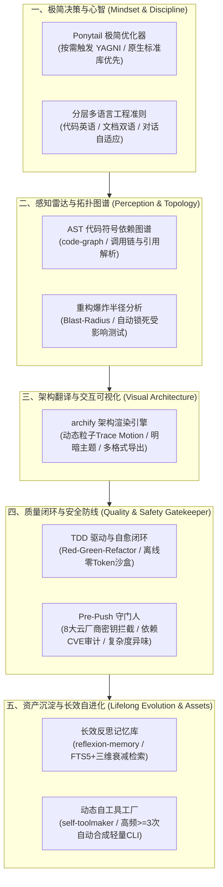

# My First AI Agent (我的第一个 AI 智能体)

<p align="left">
  <a href="README.md">English</a> | <b>简体中文</b>
</p>

一套 **coding-agent skill pack + 本地工具**：反思记忆、自造 CLI、爆炸半径、pre-push 门禁。给 IDE 里的编程助手用（Antigravity、Cursor、Claude Code），**不是**独立的 LLM 运行时。

一层薄循环（`src/agent/`）把它们串起来：检索记忆 → 建议/执行工具 → 可选爆炸半径 → 失败写回。

---

## 这套工具解决什么问题？

当前主流的 AI 编程助手大多只是单纯的“打字机”，在实际项目中往往带来沉重的心智负担：
- **过度设计与代码膨胀**：做一个轻量功能却生成一堆抽象接口、工厂类和无谓的 npm 依赖，徒增技术债务；
- **“改 A 崩 B”的暗箭**：修改核心模块时对下游调用链两眼一抹黑，引发连环 Regression；
- **密钥泄露与安全隐患**：一不留神就将包含真实 API Token 的代码打入 Git Commit；
- **频繁失忆与反复踩坑**：换个会话便忘记历史环境排查经验，在同一个报错深坑里反复打转。

### 核心设计哲学
> **“最稳健、最少 Bug 的代码，是根本无需被写出的代码；把重复交给机器，把确定性留给人类。”**

这些 skill 和本地 CLI 补上宿主 Agent 通常会翻车的五件事：
1. **极简主义决策心智（[`Ponytail`](https://github.com/DietrichGebert/ponytail)，作者：Dietrich Gebert）**：按需激活 7 阶 YAGNI 阶梯，原生标准库优先、消除冗余抽象，释放常规架构设计自由度；
2. **代码感知与影响面雷达（`AST & Blast-Radius`）**：修改前瞬间解析依赖拓扑，预判波及模块并精确圈定受影响测试；
3. **确定性质检与安全防线（`TDD 沙盒自愈` + `Pre-Push 守门人`）**：本地离线沙盒红绿驱动（0 Token 消耗），Push 前硬性拦截凭证泄露与高危依赖；
4. **经验沉淀与持续进化（[`Reflexion Memory`](https://arxiv.org/abs/2303.11366) + `Self-Toolmaker`）**：SQLite FTS5 记忆库主动召回历史教训，高频操作（$\ge 3$次）自动合成免依赖 CLI 脚本；
5. **架构透明与交互呈现（[`Archify`](https://github.com/tt-a1i/archify)，作者：tt-a1i）**：一键将运行轨迹与依赖拓扑编译为高颜值、带动态流光粒子的交互式单页图谱。

---

## Agent 完整能力矩阵总览（五大支柱）
 


---

## 核心架构与专属能力

1. **长期经验反思记忆（`src/memory/`）**：
   * 区别于传统文档 RAG，专注于索引和持久化**历史任务因果轨迹、环境异常成败反馈与避坑反思教训（Heuristic Rules）**。
   * 基于 Node.js 原生内建的 `node:sqlite`（WAL 模式 + FTS5 全文索引），零外部原生编译依赖。
   * 采用生成式 Agent 三维综合打分算法：相关度（$\alpha=0.5$）、新近度指数衰减（$\beta=0.2$）与重要度（$\gamma=0.3$）。
2. **动态自造工具系统（`src/toolmaker/` & `.agents/scripts/`）**：
   * 自动嗅探高频重复执行的操作与意图指纹，当频次达到 $\ge 3$ 次时自动提炼并合成规范的 Node.js CLI 工具。
   * 统一资产分发器：`node .agents/scripts/runner.js <tool-name> [args]`。
3. **交互式架构可视化（[`archify`](https://github.com/tt-a1i/archify)，作者：tt-a1i）**：
   * 支持明暗主题、动态轨迹（Trace Motion）的独立交互式 SVG/HTML 架构全景图，提供多格式无损导出能力。
4. **Ponytail 极简编码心智优化器（[`.agents/skills/ponytail/`](https://github.com/DietrichGebert/ponytail)，作者：Dietrich Gebert）**：
   * 按需激活的 7 阶必要性阶梯（YAGNI、代码库复用、标准库优先、原生特性优先、已装依赖优先、单行优先）。仅在用户明确要求极简、代码瘦身或消除冗余抽象时介入，坚决不限制常规架构规划与扩展性设计。
5. **分层多语言国际化（`src/i18n.js` & `locales/`）**：
   * 基于 `i18next` 运行时，支持字典 100% 对齐审计、运行时自适应切换与 CLI 工具多语言输出。
6. **测试驱动与自愈闭环（`tdd-workflow`）**：
   * 严格贯彻 Red-Green-Refactor 研发准则；新功能与 Bug 修复前必须先编写复现断言测试。沙盒内零外部网络执行，零多余 Token 损耗。
7. **Pre-Push 安全与代码异味守门人（`pre-push-check`）**：
   * 严守“仅在 `git push` 前触发”的铁律（通过 `.git/hooks/pre-push` 或 CLI 触发），硬性拦截硬编码 API Key/Token，审计依赖高危漏洞，预警函数过长与过深嵌套。
8. **深度代码符号图谱与修改影响面分析（`src/graph/` & `blast-radius.js`）**：
   * 基于 Acorn 的 AST 符号依赖图谱（需先 `npm install` 安装 `acorn` + `acorn-walk`）。精准量化直接与间接波及模块（爆炸半径），自动圈定受影响测试套件，并生成防崩重构预案。
9. **大词与模糊意图反向澄清准则（`AGENTS.md`）**：
    * 严格拦截“做一个商城/博客/社交平台”等宏观大词并实施编码熔断；通过 `/grill-me` 与 `ask_question` 交互式苏格拉底追问确立确定性 MVP 边界，复杂逻辑先出 `archify` 流程图给用户签署确认后再开启 TDD 编码。
10. **统一 Agent Loop（`src/agent/`）**：
    * 核心流水线：`plan` 检索反思记忆并建议自造工具；`run` 执行注册工具；`reflect` 写入诊断后的经验。改 `src/` 前宿主必须先 `plan --target`。
11. **对抗式代码审查（`.agents/skills/adversarial-review/` & `adversary-check.js`）**：
    * 红蓝双阶段冷眼审查：事务、测试隔离、正则边界、仓库卫生。

---

## 可选：context-mode MCP

**不是**核心循环的一部分。只在 **Antigravity、Cursor、Claude Code** 里，会话很长、工具输出很大（浏览器快照、issue 列表、日志）时再开。不要把它当成第三套记忆：教训仍归 reflexion，重构仍归 blast-radius。

**不要**写进 `npm install`（否则每个 clone 都会带上 `better-sqlite3`）。宿主按需启动，配置见 [`.agents/plugins/context-mode/mcp_config.json`](.agents/plugins/context-mode/mcp_config.json)：

```bash
npx -y context-mode
```

---

## 项目目录结构

```text
.
├── .agents/
│   ├── plugins/context-mode/       # 可选 MCP：长会话 / 重工具输出
│   ├── scripts/                    # 沉淀的自造 CLI 脚本资产 (runner.js, audit-locales.js, blast-radius.js)
│   └── skills/                     # Agent 专属技能库 (agent-loop, archify, ponytail, reflexion-memory, self-toolmaker, tdd-workflow, code-graph)
├── locales/                        # 多语言字典资源包 (en-US, zh-CN)
├── src/
│   ├── agent/                      # 统一循环：plan → tool → reflect
│   ├── memory/                     # 反思记忆引擎与 FTS5 检索引擎
│   ├── toolmaker/                  # 高频模式嗅探与 CLI 工具合成引擎
│   ├── graph/                      # 符号图谱与爆炸半径分析引擎
│   └── i18n.js                     # i18next 运行时配置
├── examples/                       # 可交互运行的演练示例
├── test/                           # 自动化测试用例套件
├── AGENTS.md                       # 项目权威规则与多层语言准则
├── README.md                       # 英文主文档
└── README.zh-CN.md                 # 中文文档
```

---

## 快速上手

### 1. 安装依赖并运行测试
```bash
npm install
npm test
```

### 2. 前置检索历史经验（避坑指南）
```bash
node src/memory/index.js search "在沙盒中安装原生模块"
```

### 3. 跑统一 Agent Loop
```bash
# 只检索记忆、建议工具（无副作用）
node src/agent/index.js plan "install sqlite native addon"

# 重构前附带爆炸半径（目标文件有未提交 diff 时自动 --diff --semantic）
node src/agent/index.js plan "refactor MemoryDatabase" --target src/memory/db.js

# 通过 loop 执行已沉淀工具（失败会写回记忆）
node src/agent/index.js run "audit locale keys" --tool audit-locales --exec
```

### 4. 调用已沉淀的项目自造工具
```bash
# 查看所有已沉淀的自造工具清单
node .agents/scripts/runner.js --list

# 重构或修改代码前：评估文件或函数符号的“爆炸半径”
node .agents/scripts/runner.js blast-radius --target src/memory/db.js --tree

# 运行 Pre-Push 安全与代码异味守门人巡检
node .agents/scripts/runner.js pre-push-check

# 执行多语言包 Key 对齐审计工具（自适应终端语言输出）
node .agents/scripts/runner.js audit-locales
```

---

## 致谢与开源致敬 (Acknowledgements & Credits)

衷心感谢为本项目提供核心灵感、开源技能体系与前沿学术思想的开发者与先驱者：

- **[Ponytail](https://github.com/DietrichGebert/ponytail)**（作者：**[Dietrich Gebert](https://github.com/DietrichGebert)**）：
  - 反过度设计与“老兵级极简主义”行为规范技能，以及极具实用价值的 7 阶 YAGNI 必要性阶梯。遵循 MIT 开源协议。
- **[Archify](https://github.com/tt-a1i/archify)**（作者：**[tt-a1i](https://github.com/tt-a1i)**，基于 Cocoon-AI/architecture-diagram-generator）：
  - 工业级交互式动态图谱编译器，提供明暗自适应主题、流光粒子轨迹（Trace Motion）与矢量导出。遵循 MIT 开源协议。
- **[LobeHub i18n 规范](https://github.com/lobehub/lobe-chat)**（作者：**[LobeHub](https://github.com/lobehub)**）：
  - 专业级 react-i18next 扁平键值对命名规范与命名空间同步理念。
- **[Reflexion 学术范式](https://arxiv.org/abs/2303.11366)**（作者：**Noah Shinn 等**）：
  - 将环境试错与因果反思升华为持久化经验规则的生成式智能体长效记忆论文与核心思想。

---

## 开源协议
[MIT](LICENSE)
