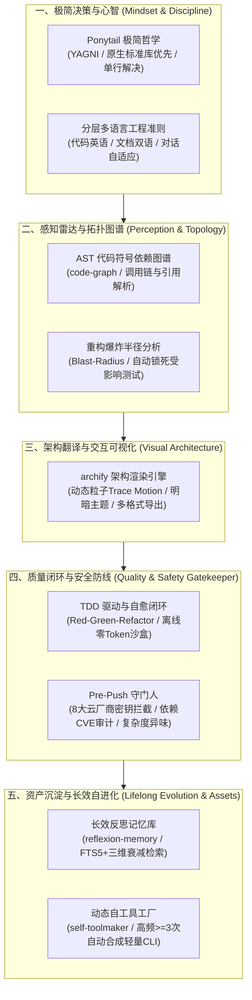

# My First AI Agent (我的第一个 AI 智能体)

<p align="left">
  <a href="README.md">English</a> | <b>简体中文</b>
</p>

一个具备自主持续进化能力的 AI Agent 工作区，集成了**长期经验反思记忆（Reflexion LTM）**、**动态自造工具系统（Self-Toolmaker）**、**上下文瘦身优化（context-mode MCP）**以及**多语言工程支持（i18n）**。

---

## Agent 完整能力矩阵总览（五大支柱）
 


<p align="center">
  <sub>交互式在线动态图谱：<a href="agent-workflow-zh.html">Agent 全流程运行图谱</a> | <a href="reflexion-memory-architecture-zh.html">反思记忆引擎架构</a>（支持明暗主题切换、Trace Motion 动态流光粒子与画布缩放平移）</sub>
</p>

---

## 核心架构与专属能力

1. **长期经验反思记忆（`src/memory/`）**：
   * 区别于传统文档 RAG，专注于索引和持久化**历史任务因果轨迹、环境异常成败反馈与避坑反思教训（Heuristic Rules）**。
   * 基于 Node.js 原生内建的 `node:sqlite`（WAL 模式 + FTS5 全文索引），零外部原生编译依赖。
   * 采用生成式 Agent 三维综合打分算法：相关度（$\alpha=0.5$）、新近度指数衰减（$\beta=0.2$）与重要度（$\gamma=0.3$）。
2. **动态自造工具系统（`src/toolmaker/` & `.agents/scripts/`）**：
   * 自动嗅探高频重复执行的操作与意图指纹，当频次达到 $\ge 3$ 次时自动提炼并合成规范的 Node.js CLI 工具。
   * 统一资产分发器：`node .agents/scripts/runner.js <tool-name> [args]`。
3. **上下文优化（`.agents/plugins/context-mode`）**：
   * 项目级隔离配置的 `context-mode` MCP 服务，大幅减少工具调用中的输出噪音与 Token 消耗。
4. **交互式架构可视化（`archify`）**：
   * 支持明暗主题、动态轨迹（Trace Motion）的独立交互式 SVG/HTML 架构全景图，提供多格式无损导出能力。
5. **Ponytail 极简编码心智哲学（`.agents/skills/ponytail/`）**：
   * 严格执行 7 阶必要性阶梯（YAGNI、代码库复用、标准库优先、原生特性优先、已装依赖优先、单行优先）。坚决剔除过度抽象，同时严格守牢边界校验、错误处理与安全底线。
6. **分层多语言国际化（`src/i18n.js` & `locales/`）**：
   * 基于 `i18next` 运行时，支持字典 100% 对齐审计、运行时自适应切换与 CLI 工具多语言输出。
7. **测试驱动与自愈闭环（`tdd-workflow`）**：
   * 严格贯彻 Red-Green-Refactor 研发准则；新功能与 Bug 修复前必须先编写复现断言测试。沙盒内零外部网络执行，零多余 Token 损耗。
8. **Pre-Push 安全与代码异味守门人（`pre-push-check`）**：
   * 严守“仅在 `git push` 前触发”的铁律（通过 `.git/hooks/pre-push` 或 CLI 触发），硬性拦截硬编码 API Key/Token，审计依赖高危漏洞，预警函数过长与过深嵌套。
9. **深度代码符号图谱与修改影响面分析（`src/graph/` & `blast-radius.js`）**：
   * 零外部网络依赖的 AST 符号依赖图谱引擎。精准量化直接与间接波及模块（爆炸半径），自动圈定受影响测试套件，并生成防崩重构预案。

---

## 项目目录结构

```text
.
├── .agents/
│   ├── plugins/context-mode/       # 项目私有 MCP 插件配置
│   ├── scripts/                    # 沉淀的自造 CLI 脚本资产 (runner.js, audit-locales.js, blast-radius.js)
│   ├── skills/                     # Agent 专属技能库 (archify, ponytail, reflexion-memory, self-toolmaker, tdd-workflow, code-graph)
│   └── memory.db                   # SQLite 持久化经验与反思数据库
├── locales/                        # 多语言字典资源包 (en-US, zh-CN)
├── src/
│   ├── memory/                     # 反思记忆引擎与 FTS5 检索引擎
│   ├── toolmaker/                  # 高频模式嗅探与 CLI 工具合成引擎
│   ├── graph/                      # 符号图谱与爆炸半径分析引擎
│   └── i18n.js                     # i18next 运行时配置
├── examples/                       # 可交互运行的演练示例
├── test/                           # 自动化测试用例套件
├── AGENTS.md                       # 项目权威规则与多层语言准则
├── README.md                       # 英文主文档
└── README.zh-CN.md                 # 中文文档
```

---

## 快速上手

### 1. 运行自动化测试套件
```bash
npm test
```

### 2. 前置检索历史经验（避坑指南）
```bash
node src/memory/index.js search "在沙盒中安装原生模块"
```

### 3. 调用已沉淀的项目自造工具
```bash
# 查看所有已沉淀的自造工具清单
node .agents/scripts/runner.js --list

# 重构或修改代码前：评估文件或函数符号的“爆炸半径”
node .agents/scripts/runner.js blast-radius --target src/memory/db.js --tree

# 运行 Pre-Push 安全与代码异味守门人巡检
node .agents/scripts/runner.js pre-push-check

# 执行多语言包 Key 对齐审计工具（自适应终端语言输出）
node .agents/scripts/runner.js audit-locales
```

---

## 开源协议
MIT
