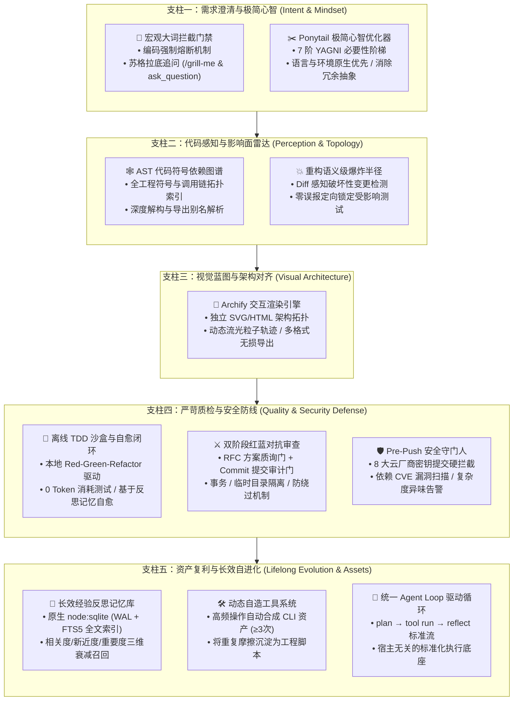

# ⚡ My First AI Agent (我的第一个 AI 智能体)

<p align="center">
  <b>面向 IDE 编程助手的工业级工程防御堡垒</b>
  <br />
  <i>为 Cursor、Antigravity、Claude Code 注入长效架构记忆、重构爆炸半径雷达、极简心智约束与零信任安全门禁。</i>
</p>

<p align="center">
  <a href="https://nodejs.org/"></a>
  <a href="LICENSE"></a>
  <a href="test/"></a>
  <a href=".agents/skills/"></a>
  <a href="README.md"></a>
</p>

<p align="center">
  <a href="README.md">English</a> | <b>简体中文</b>
</p>

---

## 💡 “打字机型 AI” 的工程痛点

当前主流的 AI 编程助手大多就像精力过剩的初级打字员：它们打字极快，但**没有记忆**、**缺乏架构全景感知**、**缺乏工程克制力**，在实际研发中频频踩坑：
- 🏗️ **过度设计与代码膨胀**：做一个 10 行代码的轻量特性，却自作主张生成 8 个工厂类、5 个抽象接口和 3 个未经安全审计的 npm 依赖；
- 💥 **“改 A 崩 B”的暗箭**：随意修改公共函数签名，对下游调用链两眼一抹黑，引发连环线上故障；
- 🔑 **凭证密钥泄露隐患**：一不小心就把云厂商 API Key、数据库密码或私钥打入 Git Commit；
- 🔄 **严重失忆与反复踩坑**：换个窗口便忘记刚刚排查出来的环境巨坑，在同一个错误报错里原地打转；
- 🌀 **面对宏观大词盲猜瞎写**：听到一句“帮我做一个电商商城”或“写个社区后台”，立马盲写 500 行脱离业务实际的无用代码；
- 🤝 **PR 审查“橡皮图章”**：自我审查走过场，缺乏独立的红队对抗视角，对潜在的事务漏洞与竞态漏洞熟视无睹。

### 🛡️ 为什么需要这套 Agent 工程防御系统？

本项目**不是**又一个重复造轮子的独立 LLM 运行时，而是一套专为宿主编程 Agent（**Google Antigravity、Cursor、Claude Code**）量身打造的**工业级技能包与本地确定性工具防线**。

它通过严苛的工程行为准则、确定性静态分析引擎与长效反思记忆，让原本失控的 AI 编程助手转变为严谨可靠的高级工程师：

| 典型工程挑战 | 普通 AI 助手（“打字机”） | ⚡ 本项目 AI Agent 系统 |
| :--- | :--- | :--- |
| **模糊大词需求** | 凭空盲猜，直接吐出 500 行不可运行的伪代码 | **编码强制熔断**；启动苏格拉底式 `/grill-me` 追问，锁定确定性 MVP 范围与数据边界 |
| **架构克制力** | 滥用设计模式与外部依赖，代码极速膨胀 | **Ponytail 7 阶 YAGNI 阶梯**：标准库优先、语言原生优先、杜绝过度抽象 |
| **重构安全防线** | 盲改文件，下游依赖模块与测试崩坏而不自知 | **AST 符号图谱与语义级爆炸半径**：毫秒级推演直接/间接波及面，精准锁死受影响测试套件 |
| **架构对齐与可见性** | 打印枯燥晦涩的 Markdown 纯文本长篇大论 | **Archify 交互引擎**：自动编译带动态流光粒子轨迹、支持明暗主题的单页交互图谱 |
| **回归测试与成本** | 每次校验都要重新向大模型提问，巨额消耗 Token | **确定性 TDD 离线沙盒**：Red-Green-Refactor 本地闭环运行，通过用例 **0 外网 Token 消耗** |
| **代码审查深度** | 自己写的代码自己点赞，严重缺乏客观审视 | **全生命周期双阶段红蓝对抗**：前置 RFC 质询门 + 后置 Commit 审计门，独立 Subagent 严格质检 |
| **代码与凭证安全** | 经常失误将生产 API Key 和私钥提交入库 | **Pre-Push 守门人**：硬性拦截 8 大主流云厂商与 SaaS 密钥，扫描高危 CVE 依赖与代码异味 |
| **经验沉淀与失忆** | 每次开新会话清空记忆，历史踩坑教训完全归零 | **原生 SQLite FTS5 反思记忆**：持久化任务因果与避坑启发式，三维算法召回相关历史教训 |
| **高频机械重复** | 相同的排查与构建命令每个会话重复手动敲 | **动态自造工具系统**：检测到 $\ge 3$ 次重复模式，全自动合成为规范的 Node.js 本地 CLI 资产 |

---

## 🏛️ 核心设计哲学

> **“最稳健、最少 Bug 的代码，是根本无需被写出的代码；把重复交给机器，把确定性留给人类。”**

---

## 🧭 能力全景：五大工程支柱 (The Five Pillars)

系统构建了严谨的**五大端到端工程能力支柱**，从需求接入的一瞬间起，全程护航代码的孕育、推演、视觉确认、测试质检直至资产沉淀：



---

## 🔍 核心能力深度拆解（严格按照五大支柱同序）

### 支柱一：需求澄清与极简心智 (Intent & Mindset)

#### 1.1 宏观大词模糊意图拦截门禁 (`AGENTS.md`)
- **痛点场景**：用户输入“帮我做一个电商商城”或“写个知识社区”，普通 AI 立即狂敲代码，生成一堆脱离实际业务诉求的无用伪逻辑。
- **解决方案**：在规则层建立**代码编写强制熔断机制**。一旦检测到宏观无边界的大词，Agent 坚决禁止直接动笔写代码，而是触发苏格拉底式需求发掘面试（通过 `/grill-me` 或 `ask_question`）：
  - 探明核心用户旅程与最关键的一条用户故事；
  - 严格圈定 MVP（v0.1）范围，明确界定“当下做什么”与“当下坚决不做什么”；
  - 敲定技术边界与核心实体关系；
- 唯有在需求完全确定并由用户签署确认后，才获准启动编码。

#### 1.2 Ponytail 极简心智优化器（[`.agents/skills/ponytail/`](https://github.com/DietrichGebert/ponytail)，作者：Dietrich Gebert）
- **痛点场景**：大语言模型普遍存在“架构过度狂热”——明明用一个原生数组方法就能解决的问题，偏要引入三层工厂类、泛型适配器和第三方 lodash 依赖。
- **解决方案**：注入资深架构师的 **Ponytail 7 阶 YAGNI 必要性阶梯**：
  1. *第 1 阶 (YAGNI)*：这东西真的必须做吗？能否直接不做？
  2. *第 2 阶 (现有复用)*：当前代码库中是否已有现有函数或工具能直接复用？
  3. *第 3 阶 (语言原生)*：现代化 JavaScript/Node.js 内建标准库是否已有原生支持？
  4. *第 4 阶 (平台环境)*：操作系统、Shell 或宿主环境原生命令是否能直接搞定？
  5. *第 5 阶 (已有依赖)*：`package.json` 中已安装的依赖是否已有此功能？
  6. *第 6 阶 (极简自写)*：编写单一职责、零冗余抽象的高内聚自研代码。
  7. *第 7 阶 (新增依赖)*：严控新增外部 npm 依赖，必须提供严密的正当性依据。

---

### 支柱二：代码感知与影响面雷达 (Perception & Topology)

#### 2.1 AST 代码符号依赖图谱 (`src/graph/`)
- **痛点场景**：传统大模型将源码当成平面文本阅读，完全缺乏对词法作用域、模块导出表和跨文件调用链的精确感知。
- **解决方案**：基于 Acorn AST 语法树解析（`acorn` + `acorn-walk`），对全工程代码构建深度符号索引：
  - 提取类、函数、变量、ESM 与 CommonJS 导入导出清单；
  - 精确处理跨模块相对路径解析、深层对象解构与命名别名（如 `const { a: foo } = require(...)`）；
  - 精准记录符号调用点，并自动剔除全局内建对象（如 `console.log`、`Math.max`、`JSON.stringify` 等）的假阳性匹配。

#### 2.2 重构语义级爆炸半径分析 (`blast-radius.js` & `src/graph/`)
- **痛点场景**：典型的“改 A 崩 B”连锁故障。修改了某个底层工具函数的参数，导致下游十几处依赖调用隐蔽抛错，而开发者浑然不知。
- **解决方案**：在改动代码前，运行前置影响面雷达进行穿透式推演：
  - **Diff 感知切片**：结合未提交工作区修改（`git diff`）与 AST 映射，精准判断改动范围是私有内部实现（`LOCAL_PRIVATE`，低风险）还是公共外部契约（`PUBLIC_CONTRACT`，高风险）；
  - **语义级破坏性判断**：深度对比形参变更。增加带默认值的可选参数（`fn(a, b = 1)`）自动判定为兼容（`COMPATIBLE`）；增加必填参数或将同步函数改为异步却未在调用端补加 `await` 则硬性判定为破坏性变更（`BREAKING`）；
  - **自动化锁定受影响测试套件**：毫秒级找出必须回归验证的测试用例清单，实现有的放矢的高效验证。

```bash
# 修改代码前：评估文件影响面及调用树（输出 ASCII 依赖层级树）
node .agents/scripts/runner.js blast-radius --target src/memory/db.js --tree

# 针对未提交的本地修改运行 Diff 感知语义级爆炸半径检测
node .agents/scripts/runner.js blast-radius --diff --semantic
```

---

### 支柱三：视觉蓝图与架构对齐 (Visual Architecture)

#### 3.1 Archify 交互式架构渲染引擎（[`archify`](https://github.com/tt-a1i/archify)，作者：tt-a1i）
- **痛点场景**：复杂的业务调用流、状态机跃迁或微服务交互，仅靠纯文字描述极其容易产生理解分歧与沟通误解。
- **解决方案**：一键将运行拓扑与系统生命周期编译为独立交互式 HTML/SVG 动态图谱：
  - **动态流光粒子轨迹 (Trace Motion)**：生动呈现消息调用序列与数据管线流动；
  - **明暗主题无缝切换**：高对比度暗色主题与清晰亮色主题自由一键切换；
  - **多格式无损导出**：支持导出高质量矢量 SVG、高保真 PNG 以及动态 WebM 视频，供团队汇报与文档存档。

---

### 支柱四：严苛质检与安全防线 (Quality & Security Defense)

#### 4.1 零 Token 消耗的本地离线 TDD 沙盒自愈闭环 (`.agents/skills/tdd-workflow/`)
- **痛点场景**：将测试验证交给大模型反复查看日志或反复调用 API，不仅速度极慢，还会造成海量 Token 浪费并带来源码外泄风险。
- **解决方案**：
  - **严苛 Red-Green-Refactor 流程**：任何新功能或 Bug 修复，必须在 `test/` 目录下先编写复现/边界断言测试（Red 阶段），再编写最小生产代码通过验证（Green 阶段），最后重构优化（Refactor 阶段）；
  - **100% 离线沙盒运行**：所有单元测试在本地内存或临时目录中运行，零外部网络请求，通过用例的外部 Token **消耗恒等于 0**；
  - **智能自愈闭环**：测试一旦挂起，捕获堆栈后主动检索 `reflexion-memory` 查找历史已知解法，针对根本原因精准修复直至 100% 绿灯。

#### 4.2 全生命周期双阶段红蓝对抗审查 (`.agents/skills/adversarial-review/`)
- **痛点场景**：单一 Agent 容易产生“自我证实偏见”，自己编写的有缺陷方案与代码常常被自己直接盖章通过。
- **解决方案**：强制执行独立的红蓝双阶段对抗审查协议：
  - **阶段一（方案前置对抗门 - RFC Inquest Gate）**：在动笔写代码前，唤醒独立的只读红队子智能体，针对方案中的架构假设、幻觉陷阱与故障退化机制出具《方案红队质询函》，蓝队必须在方案中补齐防御条款；
  - **阶段二（代码后置对抗门 - Commit Audit Gate）**：代码通过全部测试后、在执行 `git commit` 前，先通过 `node .agents/scripts/runner.js adversary-check --staged` 进行基准静态巡检（事务 ACID、临时目录隔离、正则边界），再交由独立红队子智能体审查真实的 Git Diff 并签发《代码红队裁决书》。

#### 4.3 Pre-Push 安全凭据与代码异味守门人 (`.agents/scripts/pre-push-check.js`)
- **痛点场景**：开发者或 AI 意外将包含真实生产 Token、私钥或高危漏洞依赖的代码 Push 到 GitHub 公共仓库。
- **解决方案**：严守在 `git push` 前触发（通过 `.git/hooks/pre-push` 钩子或 CLI 触发）：
  - **8 大云厂商密钥硬拦截（Exit Code 1）**：采用正则组合与香农熵算法，深度扫描包括 OpenAI、Anthropic、GitHub PAT、AWS、Google Cloud、Stripe、Slack 以及 RSA/SSH 私钥在内的敏感凭证；
  - **依赖 CVE 漏洞审计**：自动化执行 `npm audit`，拦截 High 及 Critical 级高危安全漏洞；
  - **代码异味健康预警**：自动巡检超过 80 行的过长函数与超过 4 层的深层嵌套代码。

```bash
# 手动运行 Pre-Push 安全门禁巡检
node .agents/scripts/runner.js pre-push-check
```

---

### 支柱五：资产复利与长效自进化 (Lifelong Evolution & Assets)

#### 5.1 原生 SQLite WAL+FTS5 长效反思经验记忆库 (`src/memory/` & `reflexion-memory`)
- **痛点场景**：传统 RAG 仅仅切片静态文档。当 Agent 花费数十分钟排查并解决了一个极为隐蔽的环境报错后，一旦关闭会话，该宝贵因果经验便永远丢失。
- **解决方案**：实现学术级 *Reflexion* 反思长效记忆架构：
  - **零外部编译负担**：基于 Node.js 22.5+ 原生内建的 `node:sqlite`（开启 WAL 并发模式与 FTS5 全文索引），无需安装任何笨重的 node-gyp C++ 编译环境；
  - **因果反思存储**：专门持久化任务时序轨迹、异常根因分析以及提炼后的避坑启发式规则（Heuristic Rules）；
  - **三维加权衰减打分算法**：综合评估相关度、新近度与重要度，精准召回历史实战经验：
    $$\text{Score} = \alpha \cdot \text{Relevance} + \beta \cdot e^{-\lambda \Delta t} + \gamma \cdot \text{Importance}$$
    （默认参数：$\alpha=0.5, \beta=0.2, \gamma=0.3$）。

```bash
# 检索历史反思记忆库（避坑指南召回）
node src/memory/index.js search "在沙盒中安装原生模块"
```

#### 5.2 动态自造工具系统 (`src/toolmaker/` & `self-toolmaker`)
- **痛点场景**：开发者每次都需要重复敲击同一串复杂的终端排查命令，严重消耗人力与心智。
- **解决方案**：
  - 自动嗅探命令执行模式与意图指纹，一旦某项操作被重复执行达到 $\ge 3$ 次，系统会自动将其提炼合成为健壮规范的 Node.js 本地 CLI 脚本；
  - 脚本统一注册到 `.agents/scripts/registry.json`，并通过分发器进行标准调用：`node .agents/scripts/runner.js <tool-name> [args]`。

```bash
# 列出当前所有已沉淀的本地 CLI 资产工具
node .agents/scripts/runner.js --list
```

#### 5.3 统一 Agent Loop 驱动循环 (`src/agent/` & `agent-loop`)
- **痛点场景**：散装的 Agent 提示词缺乏标准生命周期治理，工具执行报错无法被捕获沉淀，造成盲目重试。
- **解决方案**：提供宿主无关的标准三阶段执行流水线：
  - `plan`：前置召回长效反思记忆，匹配可用自造工具，并在修改源码前强制计算重构爆炸半径；
  - `run`：安全调度已注册的本地工具，杜绝拼接 Shell 注入风险；
  - `reflect`：诊断执行失败原因，并将排查教训自动化写回 SQLite 反思记忆库。

```bash
# 只检索记忆并推荐工具（只读规划，无副作用）
node src/agent/index.js plan "在沙盒中安装原生模块"

# 针对目标文件执行重构规划（有未提交代码时自动触发 --diff --semantic）
node src/agent/index.js plan "优化查询性能" --target src/memory/db.js

# 通过标准循环运行沉淀的工具（失败时自动将诊断反思写入记忆）
node src/agent/index.js run "审计多语言翻译键" --tool audit-locales --exec
```

---

## 🔌 可选扩展：`context-mode` MCP

针对会话极长、工具会产生海量输出（如长篇浏览器快照、数百条 Issue 列表或数十兆日志）的极端场景，可按需启动 `context-mode` MCP 服务。

- **轻量无侵入**：**不**写入项目 `package.json`（避免给每个克隆工程强制捆绑额外的 SQLite 依赖）；
- **按需唤醒**：宿主 Agent（Antigravity、Cursor 等）可通过 [`.agents/plugins/context-mode/mcp_config.json`](.agents/plugins/context-mode/mcp_config.json) 按需使用 `npx -y context-mode` 唤醒；
- *反思教训依然归 `src/memory/` 掌管，重构安全依然归 `blast-radius` 护航。*

---

## 📂 项目目录全景

```text
.
├── .agents/
│   ├── plugins/context-mode/       # 可选 MCP 插件配置（超长会话上下文减负）
│   ├── scripts/                    # 沉淀的本地 CLI 工具资产 (runner.js, blast-radius.js, pre-push-check.js)
│   └── skills/                     # Agent 专属行为规范技能 (ponytail, archify, tdd, adversarial-review 等)
├── locales/                        # 分层多语言字典资源包 (en-US, zh-CN)
├── src/
│   ├── agent/                      # 统一 Agent Loop 循环引擎 (plan → run → reflect)
│   ├── memory/                     # 长效经验反思记忆引擎 (node:sqlite WAL + FTS5)
│   ├── toolmaker/                  # 高频模式嗅探与自动化自造 CLI 工具工厂
│   ├── graph/                      # Acorn AST 代码符号图谱与语义级爆炸半径分析引擎
│   └── i18n.js                     # 终端 CLI 自适应国际化引擎
├── test/                           # 确定性自动化测试套件（100% 离线沙盒运行）
├── AGENTS.md                       # 项目权威工程规范、行为约束与安全准则
├── README.md                       # 英文主文档
└── README.zh-CN.md                 # 中文文档
```

---

## 🚀 快速上手 (Quickstart)

### 1. 环境准备与依赖安装
运行本项目需使用 **Node.js ≥ 22.5.0**（以支持内建的 `node:sqlite`）。
```bash
# 克隆仓库
git clone https://github.com/your-org/my-first-ai-agent.git
cd my-first-ai-agent

# 安装依赖
npm install

# 运行 100% 本地离线沙盒自动化测试
npm test
```

### 2. 体验核心工程超能力

#### 重构前爆炸半径雷达推演
```bash
# 修改核心代码前：检查下游调用链与波及的测试套件
node .agents/scripts/runner.js blast-radius --target src/memory/db.js --tree
```

#### Pre-Push 安全与敏感凭据巡检
```bash
# 提交代码前执行密钥扫描与高危 CVE 审计
node .agents/scripts/runner.js pre-push-check
```

#### 检索历史实战反思记忆
```bash
# 召回历史真实调试踩坑教训与启发式规则
node src/memory/index.js search "在沙盒中安装原生模块"
```

#### 体验统一 Agent Loop
```bash
# 针对核心数据库类推演重构计划（附带 Diff 语义分析）
node src/agent/index.js plan "优化查询性能" --target src/memory/db.js
```

---

## 🤝 致谢与开源贡献者 (Acknowledgements & Credits)

衷心感谢为本项目提供核心灵感、开源技能体系与前沿学术思想的开发者与先驱者：

- **[Ponytail](https://github.com/DietrichGebert/ponytail)**（作者：**[Dietrich Gebert](https://github.com/DietrichGebert)**）：
  - 反过度设计与“老兵级极简主义”行为规范技能，以及极具实用价值的 7 阶 YAGNI 必要性阶梯。遵循 MIT 开源协议。
- **[Archify](https://github.com/tt-a1i/archify)**（作者：**[tt-a1i](https://github.com/tt-a1i)**，基于 Cocoon-AI）：
  - 工业级交互式动态图谱编译器，提供明暗自适应主题、流光粒子轨迹（Trace Motion）与矢量导出。遵循 MIT 开源协议。
- **[LobeHub i18n 规范](https://github.com/lobehub/lobe-chat)**（作者：**[LobeHub](https://github.com/lobehub)**）：
  - 专业级 react-i18next 扁平键值对命名规范与命名空间同步理念。
- **[Reflexion 学术范式](https://arxiv.org/abs/2303.11366)**（作者：**Noah Shinn 等**）：
  - 将环境试错与因果反思升华为持久化经验规则的生成式智能体长效记忆论文与核心思想。

---

## 📄 开源协议
本项目采用 [MIT 许可证](LICENSE) 开源。
